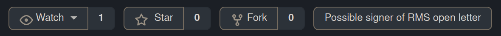

A bit opposite thing for https://github.com/aaronbassett/rms-letter-sigs
It marks repositories of pull requesters (there is no easier way to get signers) or https://rms-open-letter.github.io/

# Installation

It requires GreaseMonkey or a similar extension. You can install the script here: https://github.com/alex4321/rms-open-letter-sigs/raw/main/rms-open-letter-sigs.user.js